# Voorwoord

TBA

# Inleiding

Dit afstudeerproject is in opdracht van Fresh Heroes en Lifely. Fresh Heroes is een stagevacaturebank gespecialiseerd voor CMD Stages. Het is een vrij nieuwe stagebank die in maart 2017 live ging.

Lifely is een mediabureau dat zich specialiseert in het bouwen van webapplicaties voor bedrijven. Fresh Heroes is bedacht en gebouwd door Lifely, maar het plan is wel om er een zelfstandig platform van te maken.

In november 2017 is de eerste werknemer van Fresh Heroes aangenomen. Het uiteindelijke plan voor Fresh Heroes is om er een non-profit platform te maken dat wordt onderhouden door studenten voor studenten. Tijdens deze afstudeeropdracht is Lifely nog nauw betrokken bij Fresh Heroes en helpen zij ook mee met de ontwikkeling van het platform.

Toen ik dit project begon had het een andere invulling. Ik zou A/B testen gaan implementeren en deze gebruiken om de gebruikers registratie te verbeteren. Dit was echter wel een grote opgave, maar hierdoor kwamen we wel bij het huidige probleem: de gebruikers data is slecht inzichtelijk. Dit bleek een stuk behapbaarder te zijn en heb ik samen met mijn afstudeerbegeleider besloten hier op te gaan focussen. Door middel van mijn eindproduct kan Fresh Heroen nieuwe inzichten verkrijgen in de gebruikers en hun gedrag op de website.

Een van de knelpunten van dit project is het bouwen van de datavisualisaties. Het koste meer tijd dan ik had verwacht om de data die ik terugkreeg om te vormen zodat het bruikbaar was om een datavisualisatie mee te maken.

In dit rapport beschrijf ik het proces wat ik heb doorgelopen om tot mijn eindproduct te komen. In het eerste deel leg ik uit wat de situatie, context en probleemstelling is en hoe ik dit heb aangepakt. In het tweede deel ligt ik mijn onderzoek toe. Dit heb ik per onderwerp opgesplitst in de hoofdstukken Techniek, Gebruikersdata & Veiligheid en Datavisualisatie. Daarna volgen de hoofdstukken Validatie, Eindproduct, Conclusie en Aanbevelingen.


# Management samenvatting

##Business Intelligence Dashboard voor de Stagevacaturebank Fresh Heroes

Ik wil voor Fresh Heroes een oplossing maken waardoor zij makkelijker inzicht kunnen krijgen in hun gebruikers en hun acties op de website.

Door middel van het samenvoegen van gebruikersgedrag en data uit Google Analytics wil ik een oplossing bouwen waarmee de eigenaren van Fresh Heroes keuzes kunnen valideren en onderbouwen.
Ik heb onderzoek gedaan naar datavisualisaties, de wensen van mijn gebruikers en de technische oplossingen. Met deze data heb ik een eerste oplossing gebouwd en deze getoetst aan mijn gebruikers. Omdat ik een werkend product wil opleveren sla ik een groot deel van de concept fase over en ontwerp ik direct in de browser met echte gebruikers data.

Ik doe veel deskresearch, met name op het gebied van datavisualisaties, daaruit komen dan belangrijke punten over wat een goede datavisualisatie nodig heeft.
Ook bekijk ik naar bestaande dashboards en sla ik degene die mij inspireren op om zo een overzicht te krijgen naar verschillende mogelijkheden.
Verder vraag ik vaak aan mijn gebruikers wat zij verwachten en vooral wat ze zouden willen bereiken meet de oplossing. In een later stadium ga ik mijn gemaakte oplossing testen bij mijn gebruikers om deze resultaten te verwerken in het product
Als laatste heb ik ook onderzoek gedaan naar de privacy van het opslaan van gebruikersdata, gekeken of Fresh Heroes zich houdt aan de wet en wat ze kunnen doen om de privacy voor hun gebruikers te verbeteren.

*Resultaten:* Aan de hand van mijn onderzoek heb ik een benchmarking gemaakt van de deskresearch naar bestaande oplossingen en waar deze te kort schieten. Ook heb ik voor mijn datavisualisatie richtlijnen opgesteld waaraan deze moet voldoen.
Omdat we gebruikers data opslaan is veiligheid en de gebruiker informeren ook belangrijk, daarom heb ik de huidige situatie geïnventariseerd en met de product eigenaar overlegd over het aanpassen van de gebruiksvoorwaarden en andere maatregelen.
Door middel van de interviews heb ik een user requirements list, waarmee ik kan besluiten wat ik ga bouwen. Deze is geprioriteerd, omdat er niet genoeg tijd is alle punten te verwerken.
Als laatste heb ik een werkend prototype dat bijna klaar is voor productie. Deze is gemaakt met een combinatie van deskresearch (bij kleine problemen), hulp van mijn collega’s (bij grote problemen) en peer reviews (bij onderdelen die klaar zijn voor testen).

*Discussie:* In mijn eerste iteratie van mijn opdracht zou ik geheel iets anders doen, maar door middel van interviews met de gebruikers ben ik erachter gekomen dat mijn huidige onderwerp veel relevanter voor ze is.
In mijn deskresearch kwam ik vooral veel voorbeelden tegen van print datavisualisaties. Ik denk dat ik ook kwam omdat vooral boeken las over datavisualisatie en er meer informatie over interactieve datavisualisatie kan vinden via blogs en websites over design. Daarom moest ik goed kijken hoe ik door middel van interactie een extra laag aan mijn oplossing kan toevoegen.
Een ander onderwerp wat lastig bleek was het onderzoek naar gebruikersdata en veiligheid. De wet is niet geheel duidelijk over waar deze data ondervalt en aan welke regels wij ons moeten houden.

*Conclusie:* De gebruikers van mijn oplossing denken op dit moment dat ze mijn oplossing wel kunnen gaan gebruiken en ondanks dat er nog weinig data in zit zijn er wel al resultaten uit voortgekomen. Het opslaan van onze eigen gebruikersgedrag in plaats van dit uit te besteden aan een gratis service met een limiet aan de opslag tijd is ook gelukt, wat een van de belangrijkste User Requirements is.

# Orientatie

## Probleemstelling

Een probleem bij Fresh Heroes is de gebruikersdata erg verspreid staat en dat gebruikers acties niet goed kunnen worden geanalyseerd. Op dit moment wordt er gebruik gemaakt van [Mixpanel](https://mixpanel.com), [Analytics](https://analytics.google.com) en [Hotjar](https://www.hotjar.com) om inzicht te krijgen in de gebruikers.

Het nadeel van al deze externe tools is dat niet alle gewenste data wordt gemeten, niet alles inzichtelijk wordt en dat de gratis en goedkope versies vaak limieten hebben op de hoeveelheid data die wordt opgeslagen. Dit zorgt ervoor dat de data niet voor lange termijn inzichten kan worden gebruikt. Ook is het op dit moment moeilijk in te zien hoe actief een gebruiker is en wat deze dan zoal doet op Fresh Heroes (zonder daarbij een filmpje te moeten kijken).

Drop-off rates en hoe lang een gebruiker er over doet om een bepaalde actie te ondernemen zijn dingen die ze graag willen meten maar wat op dit moment nog niet gebeurt.

Een ander probleem is dat het niet mogelijk is om data van het ene platform te combineren met het andere, waardoor je de nummers moeilijker kan vergelijken. Bijvoorbeeld: aantal sollicitaties op Mixpanel in combinatie met aantal pageviews van Analytics.

Als laatste is er al veel data beschikbaar, vooral op het gebied van vacatures en sollicitaties. Op dit moment zit er in het beheerders gedeelte geen mogelijkheid om deze data in te kunnen zien.

## Doelstelling
Het doel van mijn opdracht is ervoor te zorgen deze data te stroomlijnen en te combineren met onze eigen data. Het project is geslaagd als Fresh Heroes nieuwe inzichten kan verzamelen over hun gebruikers en website via mijn product.

Omdat mijn voorliefde licht voor programmeren en het bouwen van producten die werken wil ik mij daar op focussen. Als we naar de [User Experience Hierachy of Needs model van Stephen Anderson](#anderson) kijken (afbeelding 1), wil ik mij vooral focussen om het Useable niveau te bereiken.

[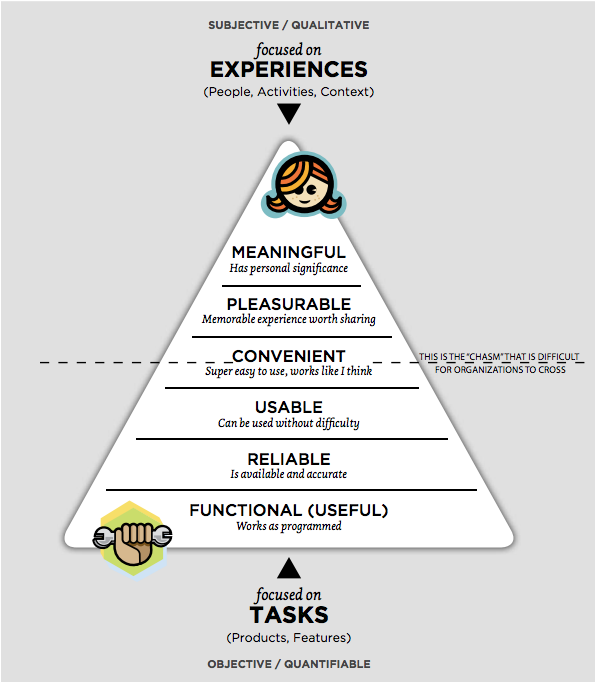](images/orientatie/image6.png)
<small>Afbeelding 1) User Experience Hierarchy of Needs model van Stephen Anderson</small>

##Oplevering

Mijn eindproduct is een uitbreiding op het huidige beheerders gedeelte, die gebruik maakt van echte data. De opgeleverde code is klaar voor productie en zorgt niet voor conflicten met het bestaande product.

##Randvoorwaarden
Omdat ik werk aan een bestaand product in een bestaande codebase zijn er een aantal randvoorwaarden waar ik mij aan moet houden.

De backend is gebouwd met het PHP framework Laravel. Als ik aanpassingen aan de backend wil doen, zal ik ook php moeten schrijven.

De code moet opgeleverd worden via de bestaande Github repository. Ik mag mijn code alleen samenvoegen met het bestaande project als deze geen erros oplevert.

##Hoofdvraag
Na het vaststellen van het probleem en doelstelling ben ik op de volgende hoofdvraag gekomen:

*Hoe kan een digitale oplossing Fresh Heroes helpen om meer inzicht te krijgen in de acties van gebruikers op de website?*

##Deelvragen
Ik heb de hoofdvraag verdeeld in meerdere deelvragen, samen geven deze antwoord op de hoofdvraag.

1. Op welke manieren kan ik in Laravel events bijhouden?
2. Welke manieren zijn er om datavisualisaties te maken en welke passen het beste bij mijn project?
3. Welke data wil Fresh Heroes inzichtelijk krijgen?
4. Welke soorten datavisualisaties zijn er?
5. Welke bestaande oplossingen zijn er al voor het bijhouden van gebruikersdata?
6. Hoe bepaal je welke grafieksoort je kiest voor je data?
7. Hoe ga je om met gebruikersdata?

##Context
###Huidige situatie
Fresh Heroes is al een draaiende website, bij mijn opdracht is het niet de bedoeling dat ik de huidige website drastisch verander. Daarom is het belangrijk dat ik weet hoe de huidige situatie er uitziet.

####Product
Fresh Heroes is een website waarop bedrijven stages kunnen plaatsen en studenten op kunnen solliciteren. Hier onder volgens een paar screenshots om een indruk te geven van de website. Om een betere indruk te krijgen kun je ook zelf een kijkje nemen op Fresh Heroes.

*Reguliere gebruikers*<br/>
[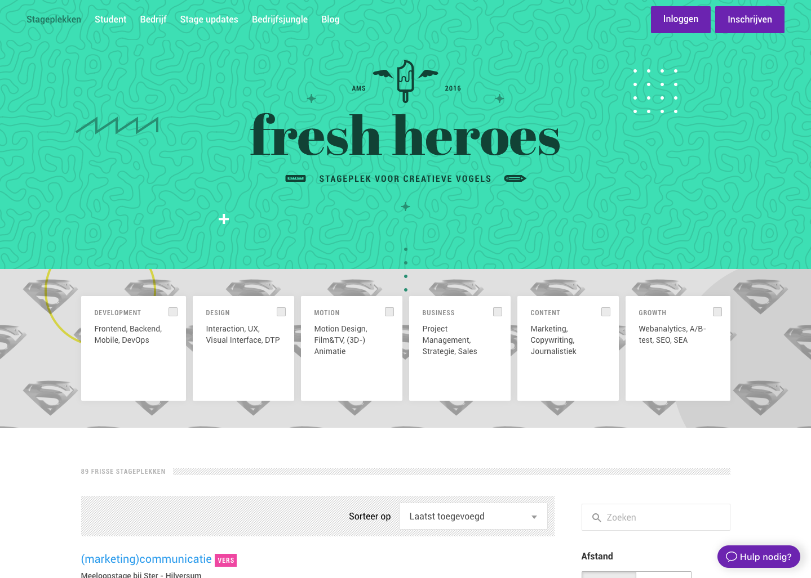](images/orientatie/image1.png)
<small>Afbeelding 2) Home</small>

[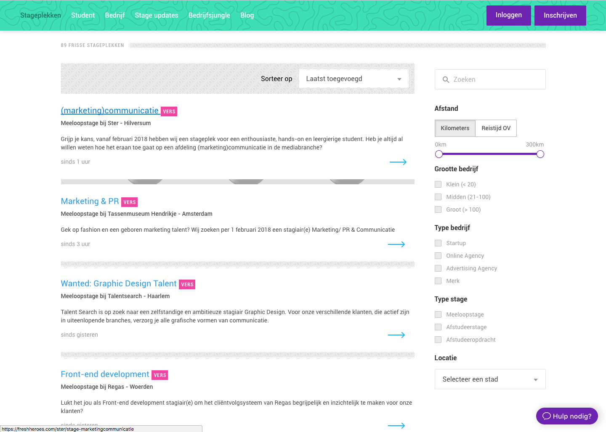](images/orientatie/image11.png)
<small>Afbeelding 3) Home - lijst met beschikbare stages</small>

[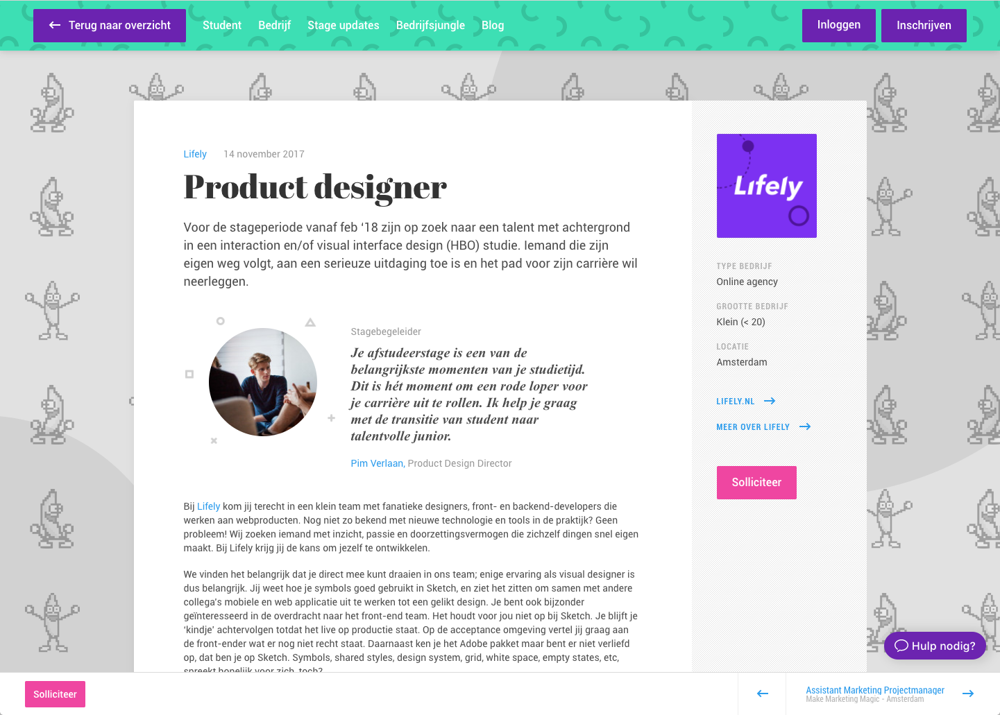](images/orientatie/image13.png)
<small>Afbeelding 4) Vacature</small>

[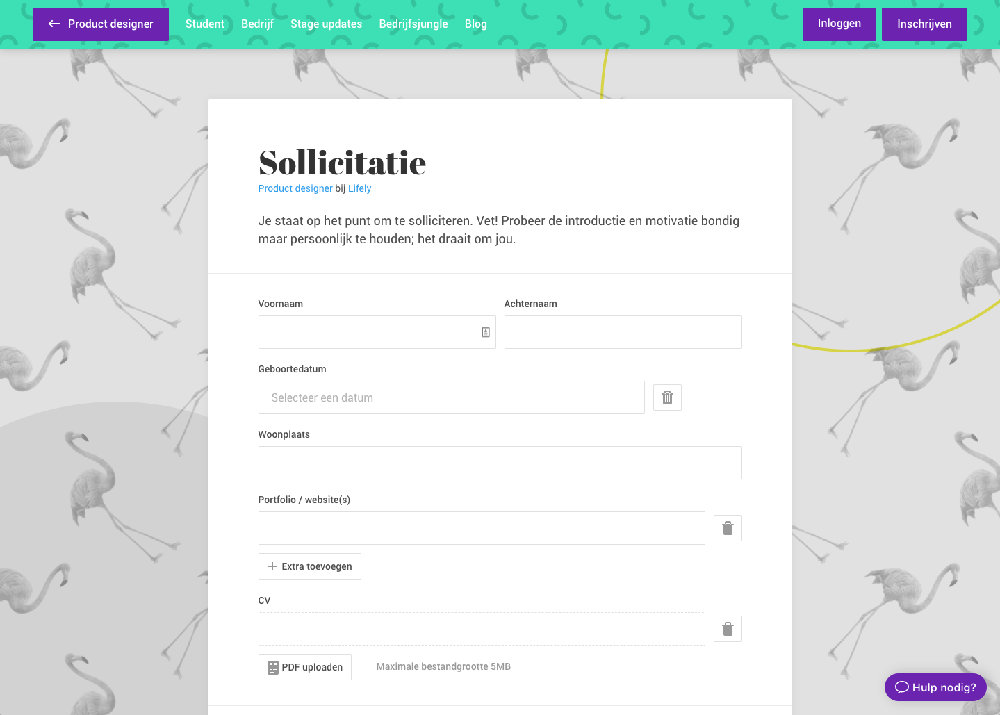](images/orientatie/image4.png)
<small>Afbeelding 5) Sollicitatie schrijven (alleen zichtbaar voor studenten)</small>

[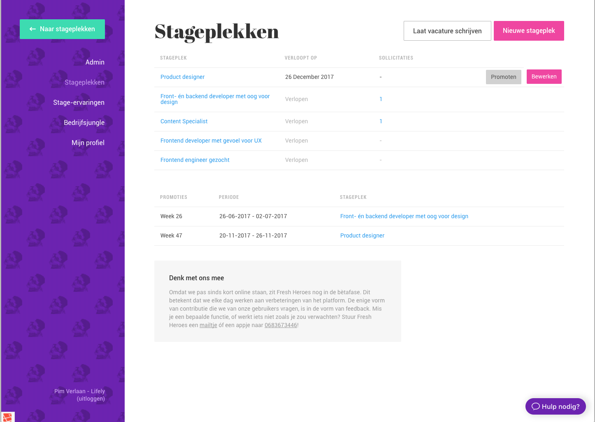](images/orientatie/image3.png)
<small>Afbeelding 6) Uitstaande vacatures (alleen zichtbaar voor bedrijven)</small>

[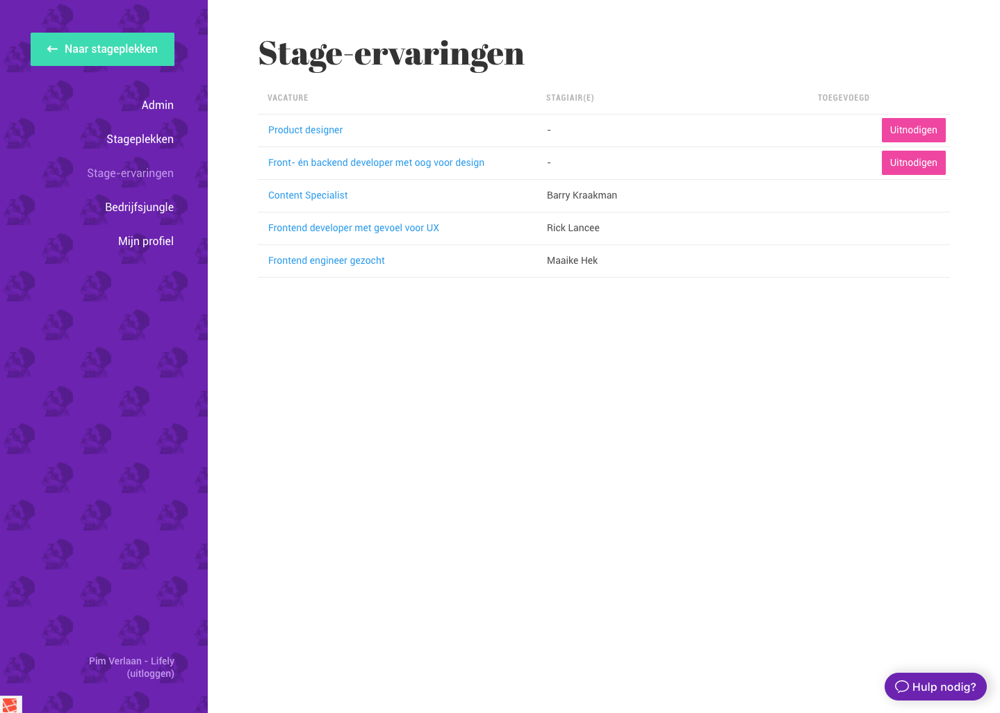](images/orientatie/image7.png)
<small>Afbeelding 7) Stage-ervaringen (alleen zichtbaar voor bedrijven)</small>


*Admin gebruikers*<br/>
Voor mensen met admin rechten (dit zijn alleen mensen die werken bij Fresh Heroes of Lifely), is er ook nog het admin gedeelte. Hier in komt ook mijn product te staan.

- In de huidige situatie is de volgende data inzichtelijk voor administratoren:
- Hoeveel bedrijven en studenten geregistreerd zijn
- Welke bedrijven door wie beheerd worden, data over
- Informatie over de drie servers Staging, Acceptance en Productie
- Wanneer er een mailings worden verstuurd, hoeveel en over welke categorieën
- Een overzicht van alle vacature promoties
- Informatie over bedrijfs jungles

Hieronder volgen een paar screenshots om een indruk te geven.

[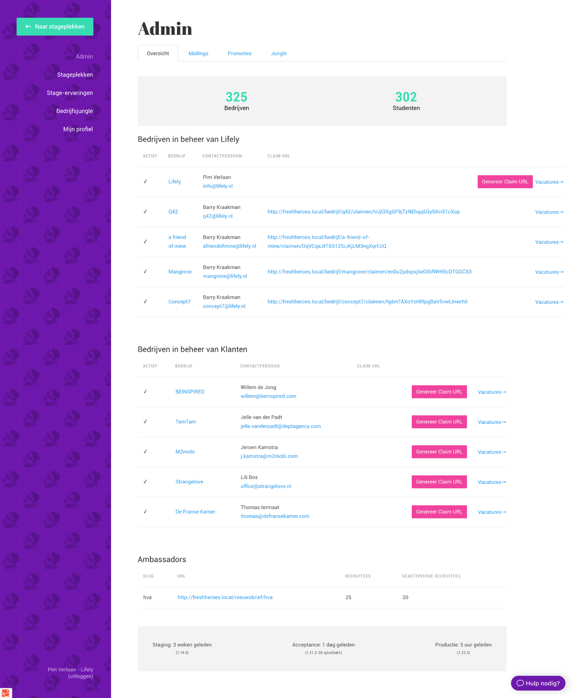](images/orientatie/image10.png)
<small>Afbeelding 8) Overzicht</small>

[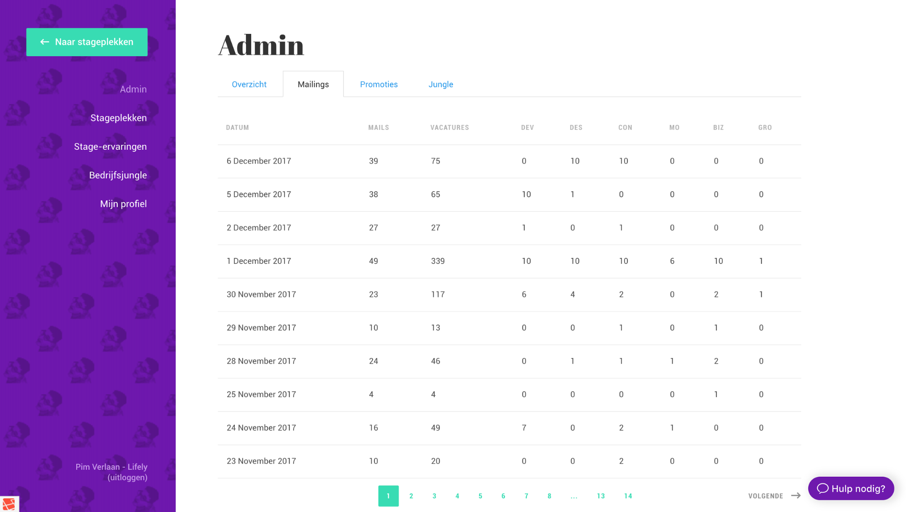](images/orientatie/image12.png)
<small>Afbeelding 9) Mailings</small>

[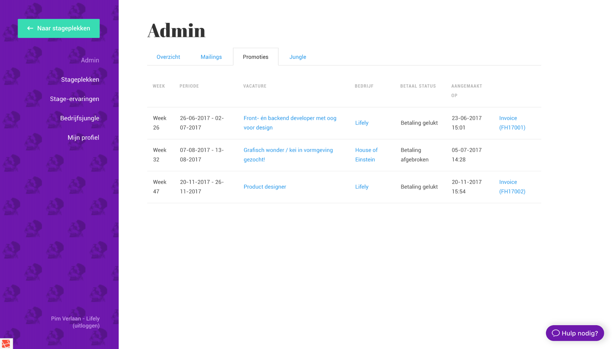](images/orientatie/image5.png)
<small>Afbeelding 11) Promoties</small>

[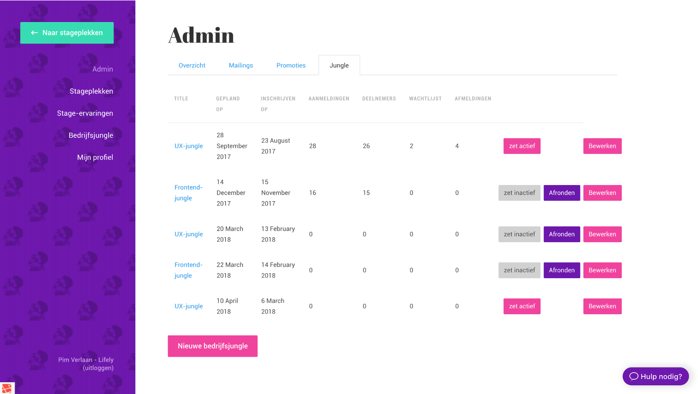](images/orientatie/image9.png)
<small>Afbeelding 12) Jungle</small>

####Data
Voor het meten van gebruikers gedrag en hun acties worden nu tools van derde partijen gebruikt: Mixpanel, Analytics en Hotjar.

Mixpanel voor bepaalde acties, zoals het bekijken van bepaalde pagina’s of sollicitaties. Ook wordt hun gebruikers overzicht gebruikt. Een nadeel voor Mixpanel is dat het op dit moment een gratis versie is en de data niet langer dan 60 dagen wordt bewaard. Ook de betaalde versie voor startups ligt niet binnen het budget en zelfs daar blijft de data maximum een jaar beschikbaar.

Analytics is voor de metrische data zoals wie wanneer de site bezoekt en hoe lang. Analytics is van Google en is erg uitgebreid in het aantal functionaliteiten. Dit is zo wel een voor- als nadeel aangezien het ook zorgt voor een leercurve. Google heeft daarom Analytics Academy gemaakt, om hun gebruikers te leren om te gaan met deze tool. 

Hotjar wordt gebruikt voor de heatmaps en de opnames van gebruikers interactie. Een nadeel van Hotjar is dat de data alleen beschikbaar is op hun website en niet via een api of op een andere manier. 

Ook wordt er al veel data bijgehouden in Fresh Heroes. Een overzicht van het huidige datamodel kan je vinden in Bijlage 1. De belangrijkste data die op dit moment wordt bijgehouden is de informatie over de vacatures, bedrijven en de gebruikers.

Door te kijken naar de aantallen van deze tabellen in bepaalde periodes kunnen al interessante conclusies getrokken worden. Denk hierbij aan dingen als welke vacatures het interessantste zijn, hoeveel vacatures een bedrijf plaatst en wanneer of op welk type vacature gebruikers het meest solliciteren. 

[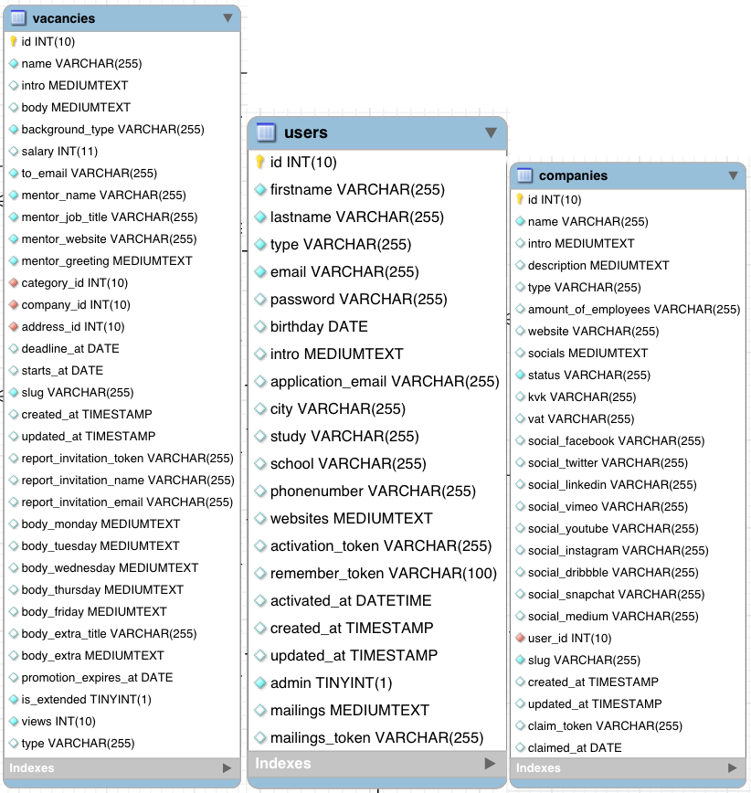](images/orientatie/image16.png)
<small>Afbeelding 13) De drie belangrijkste (bestaande) datatabelen in project</small>

####Veiligheid
TBA - Wachten op interview my Bryan… 

###Gebruikersdata en Veiligheid
Een groot deel van dit project gaat over het verzamelen van data en dit gebruiken om een product te verbeteren. Gebruikersdata kan positief gebruikt worden (zoals bij het verbeteren van producten), maar de angst bestaat dat deze data misbruikt kan worden en gebruikers kunnen schaden. Een voorbeeld hiervan zijn datalekken bij sites. Laatst nog in Amerika bij Equifax, waarbij de data van zo’n 143 miljoen gebruikers buit was gemaakt door hackers[(Ng, 2017)](#cnet). Ook moet in Nederland is dit een probleem. Rond 25 september 2017 was er bekend gemaakt dat hackers sinds november 2016 toegang hadden tot admin accounts en het mailsysteem van Deltaloid (Hopkins, 2017).

Over de privacy van het verzamelen van data wordt ook in de politiek veel gesproken. In februari 2017 heeft de tweede kamer de nieuwe Wet op de inlichtingen- en veiligheidsdiensten (ook wel de Sleepwet genoemd) aangenomen. In juli 2017 kwam deze ook door de eerste kamer (“Eerste Kamer der Staten-Generaal - Wet op de inlichtingen- en veiligheidsdiensten 2017 (34.588)”, z.d.), wat betekent dat vanaf januari 2018 de inlichtingendiensten veel meer data mogen gaan verzamelen, ook van mensen die bijv. in dezelfde straat wonen als de verdachte.

Verder wordt er op het internet overal data verzameld. Een voorbeeld hiervan zijn de reclames die producten adverteren waarop jij net nog gezocht hebt. Dit gebeurt door middel van trackers en cookies die je ongevraagd binnen krijgt als je het internet gebruikt zonder adblockers en add-ons om deze trackers uitzetten.

[](images/orientatie/image15.png)
<small>Afbeelding 14) Een voorbeeld van een advertentie nadat ik een vraag over ‘svg’ had gegoogled</small>

Ook zijn er mensen die hier op tegen zijn. Zo is het een groep gelukt om een referendum over de Sleepwet te krijgen. Verder kun je veel artikelen en blogs vinden met informatie en tips om je eigen privacy te verbeteren, bijvoorbeeld op de website van de Consumentenbond. Mensen beginnen het belangrijk te vinden om controle te hebben over wie hun data verzamelt en gebruikt. Zo antwoorden in oktober 2016 86% van de ondervraagden van het EenVandaag opiniepanel de vraag ‘Hoe belangrijk is online privacy voor jou?’ met heel belangrijk of redelijk belangrijk.

##Aanpak
Een van mijn doelen in dit project is een werkend product op te leveren, wat klaar is voor gebruik. Daarom heb ik zodra mijn user requirements duidelijk waren heb ik ze opgedeeld volgens de MoSCoW-methode (“DSDM Atern Handbook (2008)”, 2015).

Aan de start van dit project was ik van plan met duidelijke development sprints van twee weken te werken, om zo duidelijke stappen te kunnen maken.

In de praktijk bleek dat sprints van een week handiger waren. Dit komt omdat het maken van de datavisualisaties lastiger bleek dan ik dacht en meer tijd kosten. Door sprints van een week te gebruiken kan ik mij focussen op een a twee visualisaties per week en deze goed afronden. 

De technische planning lijkt op een kleine waterval:

1. Het inbouwen van events op de backend
2. Het ophalen van google analytics data en eigen event data
3. Het bouwen van de data visualisaties

Ik heb hiervoor gekozen omdat ik zonder de vorige stap de volgende niet kan uitvoeren.


#Onderzoek

##Behoeften van Fresh Heroes
Omdat Dirk Hoekstra, developer, pas in november 2017 is komen werken bij Fresh Heroes heb ik hem niet geïnterviewd over zijn behoeften en verwachtingen.

###Barry Kraakman (Product Owner)
Barry is de Product Owner van Fresh Heroes. Dat betekent dat hij zich bezighoudt met de dagelijkse gang van zaken. Dit is gevarieerd werk, van het rekruteren van nieuwe bedrijven tot het helpen van gebruikers die vast zitten. Ook houdt hij zich bezig met de marketing en helpt hij bedrijf met hun vacatures.

In zijn werk merkt hij vaak dat hij data mist om potentiële klanten te overtuigen, dat het lastig is om uit de gebruikte tools de data te halen die hij nodig heeft of dat sommige acties nog niet worden gemeten. 

Ook is een groot knelpunt dat de data van Mixpanel maar 60 dagen beschikbaar is, waardoor deze niet genoeg informatie levert als Barry een plan probeert te maken voor de lange termijn. 

Als laatste zou hij het ook fijn vinden als de belangrijkste informatie op dezelfde plek zou staan, waardoor hij minder hoeft op te zoeken en minder tijd kwijt is. 

De belangrijkste data die hij mist is informatie over vacatures en sollicitaties, zodat hij bedrijven kan helpen met de timing van hun vacatures. Daarnaast is het versturen van emails niet makkelijk en vroeg zich af of dat ook versimpelt kon worden, maar dat is van minder hoge prioriteit. 

###Pim Verlaan (Lifely Founder en Concepter)
Pim is een van de oprichters van Lifely en heeft het concept van Fresh Heroes bedacht en ontwikkelt. Toen Barry stage kwam lopen bij Lifely heeft hij het project aan hem overgedragen, maar is nog steeds betrokken bij de strategie achter Fresh Heroes.

In mijn interview met Pim werd het al snel duidelijk dat hij meer nadenkt over de lange termijn en de kosten die het bouwen en onderhouden met zich meebrengen. Zo zou hij graag willen zien hoe vaak een nieuwe feature gebruikt wordt, om zo te kijken welke wel de moeite waard waren en welke niet. 

Ook had hij het over Key Performance Indicators, de belangrijkste dingen waaraan je kan zien of Fresh Heroes goed draait. Het zou fijn zijn als deze konden worden vastgelegd en er snel zichtbaar zou zijn of deze worden behaald.

Daarnaast hebben wij het ook gehad over groeien. Meten is daarbij een belangrijk onderdeel, volgens Pim. Als Fresh Heroes weet hoeveel mensen waar en wanneer afvallen, kan dit worden verbeterd. Na de verbeteringen kan je dan snel je gebruikers op bouwen via marketing. 
Als laatste hebben wij het gehad over de kwaliteit van gebruikers. Op dit moment is dat niet inzichtelijk, maar het zou helpen een beeld te geven wat een gebruiker doet op de website. Zo zou Fresh Heroes kunnen analyseren waarom sommige gebruikers actiever zijn dan andere en er achter komen waaraan dat ligt.

###User Requirements List
Aan de hand van de interviews heb ik de onderstaande user requirements uitgewerkt en verdeeld volgende MoSCoW-methode (“DSDM Atern Handbook (2008)”, 2015). Ik heb hierbij de “Won’t have” weggelaten. De tijd van het project alleen genoeg is voor een <abbr title="Minimal Viable Product">MVP</abbr>, waardoor alles wat niet in de “Must have” lijst staat een “Won’t have” zou worden.

De user requirements list wordt vaak gewijzigd als de gebruikers op nieuwe dingen komen. Daarna overleg ik met hun hoe belangrijk dit is en plaatst ik deze op de juiste plek in de lijst.

[](images/onderzoek/image5.png)
<small>Afbeelding 15) Barry vraagt om of bepaalde informatie ook inzichtelijk wordt in mijn oplossing</small>

Om verwarring te voorkomen gebruik ik voor de gebruikers van Fresh Heroes ‘users’ en voor de gebruikers van mijn oplossing ‘gebruikers’.

####Must Have
- De gebruiker wil snel informatie kunnen aflezen
- De gebruiker willen zo ver mogelijk terug kunnen kijken in de data
- De gebruiker wil kunnen zien of er gebruikers acties zijn die niet gebeuren
- De gebruiker wil processen inzichtelijker krijgen (Bijvoorbeeld: hoeveel mensen komen op de registratiepagina en hoeveel ronden een registratie af)
- Registratie funnel (pagina bezoek -> registreren -> account activeren)
- Sollicitatie funnel (Vacature bezoek -> sollicitatiepagina bezoek -> solliciteren)
- De gebruiker in de volgende punten inzicht krijgen
- Top 10 bekeken pagina’s
- Usersessies (per week, per periode)
- User behoud
- User acquisitie (Welke kanalen, hoeveelheid, Welke social media)
- Users (Aanmeldingen, per soort, )
- Sollicitaties (per week, per periode, per categorie)
- Vacatures (per week, per periode, per categorie, welke er nu actief zijn)

####Should Have
- De gebruiker wil Key Performance Indicators aan kunnen geven 
- De gebruiker wil kunnen zien of de Key Performance Indicators worden behaald
- De gebruiker wil een overzicht van alle Fresh Heroes Users
- De gebruiker wil in de volgende punten inzicht krijgen
- Stage ervaringen
- Nieuwsbrief aanmeldingen (bijv. vs. studenten)
- Stagevergoeding en aantal sollicitaties
- Stagejungle (Wanneer, Wie, sollicitaties)

####Could Have
- De gebruiker wil de resultaten van unit tests in kunnen zien
- De gebruiker wil de kwaliteit van users kunnen zien
- Hoe vaak wordt een vacature geplaatst door een user
- Hoe vaak solliciteert een user
- Hoe vaak is de user op Fresh Heroes
- Is de user aangemeld voor de nieuwsbrief
- De gebruiker wil automatische mailings kunnen klaarzetten
- De gebruiker wil de drop off rates kunnen zien (per pagina, per event)
- De gebruiker wil de visualisaties kunnen exporteren voor gebruik in presentaties

##Techniek
In dit hoofdstuk beschrijf ik de technische onderdelen van mijn project en wat ik gedaan heb om deze te realiseren.

###Events
Na het opstellen van mijn user requirements list was het duidelijk dat het belangrijk was dat ik al vroeg begon met de ontwikkeling. Veel van de data die ze willen zien werd niet opgeslagen of kon niet worden geëxporteerd uit Mixpanel. Uit mijn literatuuronderzoek werd aangeraden om vooral te werken met echte data, maar die was niet aanwezig. Daarom werd het maken van events en deze lanceren op de website een prioriteit.

####Wat zijn events
Wanneer ik het heb over een event heb ik het over een gebeurtenis die wordt vastgelegd zodat de programmeur er iets mee kan, bijvoorbeeld opslaan in een database (“Introduction to events”, z.d.). Simpel gezegd is een event alles wat de gebruiker bewust doet, van het klikken op een knop tot het solliciteren op een vacature.

Voor mijn product tracken wij niet alle events, maar alleen degene waar Fresh Heroes data over wilt verzamelen. Welke events dit zijn bepaal ik aan de hand van mijn user requirements list en de events de op dit moment gemeten worden met Mixpanel.

####Waarom slaan wij zelf gebruikers events op?
Volgens mensen als Tristan Handy is het eigenlijk zonde van de tijd om in de beginfase van een start up je eigen events te gaan tracken. Dit klopt ook, voor de meeste start ups (Handy, 2017). Fresh Heroes heeft het voordeel dat ze uit een bestaand bedrijf voorkomt, waardoor zij kan leunen op de kennis en ervaring die daar al zit. Ook helpt het dat ik geen medewerker ben, ik doe dit als afstudeer project waardoor de developer van Fresh Heroes door kan bouwen aan het bestaande product. 

Tristan stelt zelf alternatieven voor, maar deze kosten op zijn minst 500 dollar per maand voor business intelligence tools als Mode en Looker. Dit past niet binnen het budget van Fresh Heroes.

Ook als we alleen de pro versie van Mixpanel gebruiken krijg kan je de event data maar van een jaar terug zien. Een van de belangrijke user requirements is de mogelijkheid zo ver mogelijk terug te kijken in hun event data waardoor dit geen optie is en het uiteindelijk beter is om het zelf bij te houden.

Er zijn ook mensen die hier anders over denken, Tomi Mester is zelf voorstander dan bedrijven al redelijk snel overgaan op het vergaren van eigen data. Hij noemt zelf drie problemen waar je tegenaan kan lopen wanneer de 3e partijen gebruikt voor het vergaren van data is zijn blog post “When and why to build your own data tools?” (Mester, 2017). Deze zijn:

- *Je kan niet alle verbindingen leggen*
- *Je moet moeilijk dingen voorspellen*
- *Je kan je data niet volledig vertrouwen*

Bij Fresh Heroes ligt het probleem voorals bij probleem een en twee. Probleem drie speelt op dit moment nog geen grote rol omdat we een klein aantal 3e partijen gebruiken die alledrie andere dingen bijhouden.

Het eerste probleem ontstaat doordat de data die je nodig hebt bij verschillende partijen staat. Het combineren van verschillende services is lastig omdat je afhankelijk bent van hoe zij de data aan jou aanleveren. Sommige sites leveren niet eens de mogelijkheid je data te exporteren zonder dat je er voor betaalt. Wanneer je je eigen data bijhoudt heb je deze problemen niet, je hebt volledige controle over wat je bijhoudt en hoe je dat doet.

Probleem twee staat daarvan in het verlengde, vooral als je het houdt bij de gratis versies van deze producten. Om een goede voorspelling te kunnen doen heb je veel data nodig, over een zo lang mogelijke tijd. Gratis versies zijn vaak gelimiteerd, meestal in hoelang de data beschikbaar is.

Bij Fresh Heroes is dit vooral een probleem, je kan geen stage periodes met elkaar vergelijken als je maar 60 dagen terug kan kijken. Een korte stage is 10 weken en een lange stage 20. Met de gratis versie van Mixpanel kan je dus niet eens de gehele stageperiode in zien. Dit maakt het niet mogelijk om goede voorspellingen te kunnen doen met de huidige data, maar als we dit zelf opslaan kunnen we zo ver terug kijken als we willen.

####Data Model van Events

[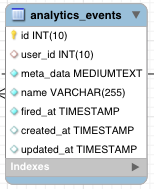](images/onderzoek/image2.png)
<small>Afbeelding 16) Analytics_events tabel</small>

Samen met Rick heb ik de bovenstaande tabel bedacht. De analytics_events is geen grote tabel op het eerste oog en heeft een optionele relatie met de User tabel. Verder heeft het een naam, meta_data en wordt er bijgehouden wanneer hij gemaakt is en geupdate.

De naam wijst naar het soort event, alle events die te maken hebben met vacatures beginnen met vacancy. en daarna wat de gebruiker gedaan heeft. 

In meta_data worden dingen over de context opgeslagen in een JSON formaat. Denk hierbij aan dingen als welke vacature er bekeken is, de naam van de vacature en in welke categorie deze zit.

Op advies van Rick heb ik voor deze structuur gekozen, omdat events erg verschillend zijn en andere context hebben. Als we al deze waardes een eigen kolom zouden geven wordt de tabel onoverzichtelijk en zijn het merendeel van de waardes leeg.

Een voorbeeld van meta_data op een vacancy.view event:

```javascript
{
    "route":"vacancy.view",
    "vacancy_id":350,
    "vacancy_name": "Online Marketing - SEO, SEA, Copywriting",
    "url":"https:\/\/freshheroes.com\/the-online-group\/stage-online-marketing-seo-sea-copywriting"
}
```

####IImplementatie van events
Voor de events van Fresh Heroes maak ik gebruik van de events functionaliteit in Laravel (“Events - Laravel - The PHP Framework For Web Artisans”, z.d.). In dit stuk leg ik uit hoe deze werkt en tot stand is gekomen. Ik heb hierbij hulp gehad van Lifely developer Rick Lancee. De nieuwe versie van de database met events kun je vinden in bijlage 2.

Events in laravel werken met Listeners. Deze doen wat de naam impliceert, ze luisteren constant of een bepaald event wordt aangeroepen.

Het event waar mijn listener naar heet AnalyticsEventFired. Hierin worden de velden die een event ontvangt opgeslagen en doorgegeven aan de Listener. Een AnalyticsEventFired heeft een naam, meta_data en een user. Wanneer er geen meta_data wordt meegegeven wordt dit opgeslagen als een lege array en als er geen user wordt meegegeven is dit null.

```php
class AnalyticsEventFired
{
    use SerializesModels;

    public $eventName;
    public $metaData;
    public $user;

    /**
     * Create a new event instance.
     *
     * @param  string  $eventName
     * @param  array  $metaData
     * @param  user  $user
     * @return void
     */
    public function __construct(string $eventName, array $metaData=[], User $user=null)
    {
        $this->eventName = $eventName;
        $this->metaData = $metaData;
        $this->user = $user;
    }
}
```

De listener heet SaveAnalyticsEvent. Deze luistert of het event AnalyticsEventFired is afgevuurd:

```php
class SaveAnalyticsEvent implements ShouldQueue {

    public function handle(AnalyticsEventFired $event)
    {

        $analyticsEvent = new AnalyticsEvent([
            'name'=>$event->eventName,
            'meta_data'=> $event->metaData,
            'fired_at'=>$event->firedAt,
        ]);

        if($event->user) {
            $analyticsEvent->user()->associate($event->user);
        }

        $analyticsEvent->save();
    }
}
```

Zodra dat gebeurt maakt hij een nieuw AnalyticsEvent aan, vult deze met de data die hij meekrijgt van het event en slaat hem. Dat is het enige wat hij doet.

Om een event af te vuren moet het worden aangeroepen op plekken waar iets interessant gebeurt, bijvoorbeeld het bekijken van een vacature of een sollicitatie.

Zo roep je in Laravel een event aan:

```php
event(new AnalyticsEventFired('vacancy.view', [
    'route' => 'vacancy.view',
    'vacancy_id' => $vacancy->id,
    'vacancy_name' => $vacancy->name,
    'url' => route('vacancy.view', ['company' => $company, 'vacancy' => $vacancy]),
    'category_id' => $vacancy->category()->get()->first()->id
], Auth::user()));
```

Met new AnalyticsEventFired zeg ik dat het een nieuw event is, in de parameters geef ik dan eerst aan hoe het event heet (vancancy.view), geef ik de meta_data mee in een associative array en als laatste geef ik de user mee. Deze komt dan in eerst in het event terecht en wordt dan doorgegeven aan de listener die hem opslaat.

Technisch gezien zouden we ook event direct kunnen opslaan, maar wij hebben gekozen om events te gebruiken om de volgende redenen:

- Een event is onafhankelijk van zijn listeners. Een event zegt alleen maar dat er iets gebeurt is met wat extra informatie. Het geeft de mogelijkheid meerdere dingen uit te voeren zonder deze handmatig aan te roepen. Als er ooit besloten wordt om de tellingen van events op te slaan kan er nog een listener gemaakt worden die naar hetzelfde event luistert, dan hoeft dit maar op een plek te worden toegevoegd en niet op elke plek waar een event wordt aangeroepen.

- Als er een error optreed in het event blijft de rest van de code gewoon door draaien. Dit is fijn voor de user, omdat het voor hun weinig uitmaakt of het event slaagt of niet 

- Het is netter, een event gebeurt pas nadat iets gebeurt is terwijl een functie aangeeft dat iets op het punt staat te gebeuren

- Het is erg makkelijk om events te queuen, dat betekent dat ze niet direct worden uitgevoerd, maar pas later. Dit is beter voor de gebruikers omdat ze dan minder lang hoeven te wachten. 

####Lijst van events
Doordat ik de naming heb overgenomen van mixpanel is de benaming van camelCase en underscores inconsistent. Ik heb dit bewust voor nu zo gelaten, voor als we toch besluiten de data uit mixpanel te exporteren dat deze dan overeenkomt met de huidige data.


Deze events zijn beschikbaar in mijn oplossing:

- auth
    <br>&nbsp;&nbsp;&nbsp;&nbsp;.activate
    <br>&nbsp;&nbsp;&nbsp;&nbsp;.claim.view
    <br>&nbsp;&nbsp;&nbsp;&nbsp;.password_reset
    <br>&nbsp;&nbsp;&nbsp;&nbsp;.password_reset.view
    <br>&nbsp;&nbsp;&nbsp;&nbsp;.register
    <br>&nbsp;&nbsp;&nbsp;&nbsp;.register.view
- admin.view
- company.view
- home
    <br>&nbsp;&nbsp;&nbsp;&nbsp;.distanceFilter
    <br>&nbsp;&nbsp;&nbsp;&nbsp;.filter
- login
- vacancy
    <br>&nbsp;&nbsp;&nbsp;&nbsp;.apply
    <br>&nbsp;&nbsp;&nbsp;&nbsp;.applyView
    <br>&nbsp;&nbsp;&nbsp;&nbsp;.create
    <br>&nbsp;&nbsp;&nbsp;&nbsp;.delete
    <br>&nbsp;&nbsp;&nbsp;&nbsp;.deleteConfirm
    <br>&nbsp;&nbsp;&nbsp;&nbsp;.deleteHasApplication
    <br>&nbsp;&nbsp;&nbsp;&nbsp;.edit
    <br>&nbsp;&nbsp;&nbsp;&nbsp;.favorite
    <br>&nbsp;&nbsp;&nbsp;&nbsp;.report.invite
    <br>&nbsp;&nbsp;&nbsp;&nbsp;.report.invite.cancel
    <br>&nbsp;&nbsp;&nbsp;&nbsp;.subscribe
    <br>&nbsp;&nbsp;&nbsp;&nbsp;.subscribeView
    <br>&nbsp;&nbsp;&nbsp;&nbsp;.view


####Verbeteringen na test in de praktijk
Nadat de events werkend waren heeft Rick ze voor mij gedeployed op de huidige website. Hier hebben ze vijf dagen gedraaid voordat ik de binnengehaalde data ging evalueren. Al snel werden een paar dingen duidelijk.

*Home.view events zijn een slecht idee*</br>
Doordat er een home.view event was werden er veel events aangemaakt waar Fresh Heroes weinig aan heeft. Deze events zorgden ervoor dat de database langzaam werd als ik data wou ophalen uit analytics_events.

Google Analytics houdt dit ook bij en deze hebben een api waaruit we de data kunnen opvragen. Daarom heb ik samen met Bryan (Lifely developer) en Rick besloten om dit event er uit te halen.

[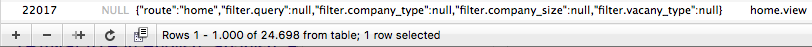](images/onderzoek/image3.png)
<small>Afbeelding 17) Meer dan 24 duizend events na vier dagen live, ongeveer 80% bleek home.view events te zijn</small>

*Het is niet zichtbaar welke events in dezelfde sessie gebeuren*</br>
Doordat we de id’s van users opslaan in events werd wel duidelijk welke events door dezelfde gebruikers gedaan zijn en door de fired_at konden we wel een idee krijgen welke waarschijnlijk bij elkaar hoorde als de gebruiker is ingelogd. Dit geld niet voor gebruikers zonder account, al deze zijn niet van elkaar te onderscheiden.

Rick wees mij erop dat je met Laravel gemakkelijk de HTTP Sessie kan opvragen en meegeven aan het event. Nu kunnen we via de session id kijken hoeveel unieke gebruikers een vacature bekijken.

[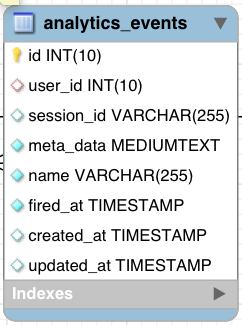](images/onderzoek/image1.png)
<small>Afbeelding 18) De geupdate analytics_events tabel</small>

*Category_id toevoegen aan de meta_data van vacancy events*</br>
Ik kwam er achter dat als ik van een vacancy event wil weten in welke categorie deze zit ik eerst de vacature moest opvragen en daarna pas de categorie krijg. Dit moet individueel voor elk event, vaak is dat 200x. Dat is een zware klus voor de database, waardoor de pagina erg langzaam wordt. Een oplossing hiervoor is om het category_id alvast op te slaan in de meta_data voor vacancy events. Samen met Dirk Hoekstra (Fresh Heroes developer) heb ik hier een migration voor geschreven. Deze past de bestaande data aan waardoor alle vacancy events een category_id krijgen.

Hier onder een voorbeeld van de geupdate vacancy meta_data

```javascript
{
    "route":"vacancy.view",
    "vacancy_id":350,
    "vacancy_name": "Online Marketing - SEO, SEA, Copywriting",
    "url":"https:\/\/freshheroes.com\/the-online-group\/stage-online-marketing-seo-sea-copywriting",
    "category":5
}
```

###Ophalen van data
Nu er events zijn en deze informatie bevatten moet deze informatie gestuurd worden van de backend naar de frontend van de applicatie. In dit hoofdstuk laat ik zien hoe we de data ophalen en doorsturen naar de voorkant.

####MVC
Onze applicatie werkt volgens het MVC-model, dat staat voor Model, View, Controller.

De Model staat voor het data model, daar heb ik in het hoofdstuk Events meer over uitgelegd. In het kort is dat de plek waar de data staat. 

```php
<?php
namespace App\Models;
use Illuminate\Database\Eloquent\Model;

class AnalyticsEvent extends Model
{
    protected $fillable = ['name', 'user_id', 'meta_data', 'fired_at', 'session_id'];

    protected $casts = [
        'meta_data'=>'object'
    ];

    protected $dates = [
        'fired_at'
    ];

    public function user()
    {
        return $this->belongsTo(User::class, 'user_id');
    }

}
```

De View doet wat de naam impliceert, het laat dingen zien. In Laravel is dat het template waar de html en php code instaat.

```php
@extends('layouts.dashboard')

@section('subcontent')
    <article class="ss-admin ss-admin--stats">
        @include('dashboard.admin.subnav')
        @include('dashboard.partials.notifications')

        <section class="ss-admindashboard">
            <div id="ss-signin"></div>
            <section class="ss-admindashboard--section">
                <div class="ss-graph ss-graph--bar ss-graph--mostVisitedPages"></div>
                <div class="ss-graph ss-graph--bar ss-graph--sessionsPerDay"></div>
            </section>
            <section class="ss-admindashboard--section">
                <div class="ss-graph ss-graph--bar ss-graph--pageViewsForPage"></div>
            </section>
        </section>
@endsection

@push('scripts')
    <script>
        window.fhAnalyticsEvents = {!! $analyticsEvents !!};
    </script>
    <script src="https://apis.google.com/js/client:platform.js" async defer></script>
    <script src="{{ url()->asset(mix('js/adminDashboard.js')) }}" defer></script>
@endpush

@push('head-scripts')
    <meta name="google-signin-client_id" content="494089095163-va551douo4p5vu7idjpu5tlp1i1vc21d">
@endpush
```

In de Controller kan je data ophalen en manipuleren. Hiermee bedoel ik dingen als een nieuw event opslaan, of een nieuwe gebruiker aanmaken. Via de Controller kan je ook data meegeven aan de View. Zo kan je bijvoorbeeld de username laten zien van een ingelogde gebruiker. 

```php
<?php

namespace App\Http\Controllers\Dashboard\Admin;

use App\Http\Controllers\Controller;
use App\Models\AnalyticsEvent;
use Carbon\Carbon;
use SEO;

class EventsController extends Controller
{
    public function index()
    {
        $fromDate = Carbon::now()->subWeek()->startOfDay();
        $analyticsEvents = AnalyticsEvent::orderBy('fired_at', 'desc')->whereDate('fired_at', '>', $fromDate)->get();

        SEO::setTitle(__t('dashboard.admin.companies.seo.title'));

        return view('dashboard.admin.events.view', [
            'analyticsEvents' => $analyticsEvents->toJson(),
            'date' => $fromDate,
        ]);
    }
}
```

[TBA: diagram van mvc]<br>
Afbeelding 19) Een diagram van het MVC-model.

Voor mijn oplossing haal ik dus de event data op uit het Model in de Controller en geef ik die door aan de View. In de View kan ik deze weer meegeven aan het window object in een script tag. Vanuit daar kan ik het uitlezen in javascript en gebruiken voor een visualisatie.

Meegeven in de view:

```php
@push('scripts')
    <script>
        window.fhNewUsers = {!! $newUsers !!};
    </script>
    <script src="{{ url()->asset(mix('js/adminDashboard.js')) }}" defer></script>
@endpush
```

Uitlezen in javascript:

```javascript
const newUsers = fhNewUsers;
```


#####Waarom niet via AJAX?
Ajax staat voor Asynchronous Javascript and XML (“Ajax”, z.d.). Hiermee kan je een request doen om data op te vragen in javascript. Dit heeft het voordeel dat je niet hoeft te refreshen als je nieuwe data wilt en je ook regelmatig verse data kan ophalen. 

De manier van data ophalen die ik beschreven heb ik het vorige hoofdstuk werkt, maar is een minder mooi dan Ajax.

Om AJAX te gebruiken voor het ophalen van Data moeten er urls komen waarop deze data te vinden is. Hiervoor moeten veel Routes worden aangemaakt in de Router. Routes zijn letterlijk de URL’s van de applicatie en de Router zorgt er voordat de je de juiste Controller er aan koppelt. 

De meeste routes hebben een Controller en een View, maar je kunt ze ook gebruiken zonder View. In plaats van een View meegeven met data stuur je dan direct de JSON naar de browser. Deze pagina heeft dan ook geen styling, maar laat alleen de data zien.

```php
<?php

namespace App\Http\Controllers\Dashboard;

use App\Http\Controllers\Controller;
use App\Models\Tag;

class TagController extends Controller
{
    public function index()
    {
        $tags = Tag::all();
        return $tags->toJson();
    }
}
```

Samen met Rick heb ik besloten om niet voor deze manier te kiezen omdat het makkelijker is om de Controller voor de pagina met visualisaties te gebruiken en het mij veel tijd gaat besparen om geen extra Routes te moeten maken. Deze optie wordt wel meegenomen als aanbeveling omdat het gebruik van AJAX de user experience kan verbeteren (Brody, 2015).

####Google Analytics
Om aan sommige user requirements te kunnen voldoen heb ik data nodig die wij zelf niet makkelijk bij kunnen houden met events. Deze data is wel beschikbaar in Google Analytics, dit was al eerder geïmplementeerd in Fresh Heroes door Rick en Bryan.

Google Analytics heeft een API om de data op te halen, de Google Analytics Reporting API. Deze kan op verschillende manieren aangeroepen worden, maar om tijd te besparen heb ik ervoor gekozen om dit via javascript te doen.

Voor de Reporting API heb je de google API client en Sign-in library nodig, deze kun je gebruiken door de volgende regel toe te voegen in je code:

```html
<script src="https://apis.google.com/js/client:platform.js"></script>
```

Wanneer deze is ingeladen kun je de Google Api aanroepen in je javascript als gapi. Om data op te kunnen vragen moet je wel ingelogd zijn met een Google Account dat toegang heeft tot analytics. Dit doe je door een Google Sign In button te renderen:

```html
<div id="ss-signin"></div>
```

```javascript
const renderButton = (function() {
    gapi.signin2.render('ss-signin', {
        'onsuccess': displayResults,
        'onfailure': onFailure,
        'theme': 'dark'
    });
})();
```

Als je dit op de juiste manier doet krijg je de button te zien:

[](images/onderzoek/image4.png)
<small>Afbeelding 20) Google sign-in button</small>

Als dat gelukt is kan je data gaan opvragen met gapi.client.request. Een standaard request naar de Reporting API ziet er als volgt uit:

```javascript
gapi.client.request({
    path: '/v4/reports:batchGet',
    root: 'https://analyticsreporting.googleapis.com/',
    method: 'POST',
    body: {
        reportRequests: [
            {
                viewId: 'XXXX',
                dateRanges: [
                    {
                        startDate: '7daysAgo',
                        endDate: 'today'
                    }
                ],
                metrics: [
                    {
                        expression: 'ga:uniquepageviews'
                    }
                ]
            }
        ]
    }
});
```

Wanneer deze code code wordt uitgevoerd krijg je terug hoeveel unieke pageviews er totaal waren op je website. Je kunt de queries uitbreiden, zo kan je dimensies aan de data geven door een dimensions array toe te voegen aan het object in reportRequests:

```javascript
dimensions: [
    {
        name: 'ga:pagePath'
    }
]
```
Als je dit zou toevoegen aan de query voor pageviews, krijg je het aantal unieke pageviews per pagina van je website.

Zo kun je meerdere dingen toevoegen zoals het aantal resultaten wat je wilt zien of je kunt de resultaten al vast laten ordenen. Een complete lijst van mogelijkheden is te vinden in de documentatie van de Reporting API bij [Creating a report](https://developers.google.com/analytics/devguides/reporting/core/v4/basics) and [Advanced use cases](https://developers.google.com/analytics/devguides/reporting/core/v4/advanced).

###Keuze voor D3
Ik heb bewust geen uitgebreid onderzoek gedaan naar de keuze van datavisualisatie frameworks. In het derde jaar van mijn opleiding heb ik les gehad in D3, dat staat voor Data Driven Documents. Ook bij Lifely heb ik meegeholpen aan een project waar ook gebruik gemaakt werd van D3.  Omdat ik hier al ervaring mee heb leek mij het de beste keuze om in de korte tijd van het project.

Ook heb ik vertrouwen in mijn keuze omdat D3 ook door grote partijen als de New York Times (“Gallery · d3/d3 Wiki”, z.d.) wordt gebruikt om datavisualisaties te maken. D3 is ook een project dat actief onderhouden wordt, ondanks dat het al 6 jaar bestaat. Verder is er een actieve community en veel voorbeelden en uitleg waar ik uit kan putten als ik vast zit.

####Hoe werkt D3?
Tba: Het toevoegen van elementen, Wat is een Data Join, Animaties, Interactie toevoegen

Bronnen: https://bost.ocks.org/mike/join/
http://www.cagrimmett.com/til/2016/08/14/d3-introduction-notes.html
http://chimera.labs.oreilly.com/books/1230000000345/index.html

###Svg of Canvas
Voordelen svg (makkelijke interactiviteit, veel voorbeelden)
Voordelen canvas (sneller)
Keuze: svg (vanwege interactiviteit)

Bronnen: https://www.sitepoint.com/canvas-vs-svg-choosing-the-right-tool-for-the-job/
https://msdn.microsoft.com/en-us/library/gg193983%28v=vs.85%29.aspx

##Gebruikersdata en veiligheid
###De huidige situatie
Bronnen: https://freshheroes.com/algemene-voorwaarden
https://freshheroes.com/privacy-policy
Interview Brian (tba wegens drukte bij Lifely)

###De wet
Wat zijn persoonsgegevens, pseudo anoniem persoonsgegevens, anonieme gegevens
Wat is big data & profiling

Onduidelijk wat er in de wet staat, valt dit onder gebruikers data of big data en profiling?

Afwachting van experts -> emails
Ik denk zelf persoonsgegevens, of pseudo anonieme persoonsgegevens vanwege user_id
Aanpassen van privacy voorwaarden FH
Mogelijkheid voor opt out opslaan gebruikers id

Bronnen: https://autoriteitpersoonsgegevens.nl/nl/onderwerpen/internet-telefoon-tv-en-post/cookies
https://autoriteitpersoonsgegevens.nl/sites/default/files/downloads/rs/rs_20071211_persoonsgegevens_op_internet_definitief.pdf
https://autoriteitpersoonsgegevens.nl/nl/onderwerpen/internet-telefoon-tv-en-post/big-data-en-profiling
http://www.iusmentis.com/maatschappij/privacy/persoonsgegevens/
https://blog.iusmentis.com/2015/01/23/mag-mijn-werkgever-google-analytics-op-het-intranet-zetten/


##Datavisualisaite

###Concurrentieanalyse
Samenvatting concurrentie analyse, link naar bijlagen

####Google Analytics
####Mixpanel
####Kissmetrics
####Baremetrics
####Wootric

####Conclusie

###Best practices
Conclusies uit literatuuronderzoek, lijst met dingen waar op je moet letten:

Kwaliteit van informatie (less is a bore)
Kleur
Contrast
Let op voor chart junk
Bepaal een doel voor je datavisualisatie (doel mijn oplossing -> informeren)

Bronnen: Information Visualization, Colin Ware
Envisioning Information, Edward R. Tufte
https://books.google.nl/books?id=N4NcDgAAQBAJ&printsec=frontcover&dq=Data+Visualization:+Representing+Information+on+Modern+Web&hl=en&sa=X&ved=0ahUKEwjYhvycwpHYAhXKEVAKHaICDykQ6AEIJzAA#v=onepage&q=Data%20Visualization%3A%20Representing%20Information%20on%20Modern%20Web&f=false
https://lisacharlotterost.github.io/2017/03/10/why-do-we-visualize-data/
https://www.interaction-design.org/literature/book/the-glossary-of-human-computer-interaction/gestalt-principles-of-form-perception
https://www.eea.europa.eu/data-and-maps/daviz/learn-more/chart-dos-and-donts

###Dashboard design
Ken je user, prioritiseer data, werk vanuit gebruikers doelen, verstop dingen die weinig belang hebben, testen

Bronnen: https://www.nngroup.com/articles/dashboards-preattentive/
https://www.invisionapp.com/blog/designing-better-dashboards/
https://www.toptal.com/designers/data-visualization/dashboard-design-best-practices

###Categoriseren van data
Gedaan op basis van feedback Barry, graag dingen die bij elkaar horen op een pagina. Statistieken van de website algemene, informatie over gebruiker en vacatures en sollicitaties zijn de pagina’s geworden.

###Interactie
Alleen nuttige interactie, moet geen circus worden. Hulp voor gebruiker om te bepalen wat hij wilt zien. Kijk naar voorbeelden van NYT. Voorbeelden nuttige interactie:
Scrollen voor meer data
Data bereik kunnen aanpassen
Zoeken
Progressive disclosure (van uit dashboard design)

Bronnen: https://www.nngroup.com/articles/progressive-disclosure/
https://www.nytimes.com/interactive/2014/upshot/buy-rent-calculator.html

###Grafiek keuze
Uitleg over verschillende soorten data. Categories, Tijd gebonden, vergelijkend, ect. (link naar lijst van Datavis catalogue). Uitleg keuzes voor alle grafieken op huidige oplossing:

Unieke pageviews per week
Sessies per dag
Page views voor {pagina} per dag
Gebruikers per soort
Aanmeldingen per type
Actieve vacatures per categorie
Nieuwe vacatures per categorie
Views en sollicitaties per categorie
Registratie funnel
Sollicitatie funnel 

Bronnen: https://datavizcatalogue.com/index.html
http://www.businessinsider.com/pie-charts-are-the-worst-2013-6?international=true&r=US&IR=T
https://www.fusioncharts.com/blog/bar-charts-or-column-charts/


#Validatie
##Tussentijdse feedback
Vaak vraag ik feedback over een grafiek aan Barry over slack, dan krijg ik opmerkingen terug over wat hij beter vind. Bijv. Line vs. Histogram, waarvoor histogram gekozen is. Voornamelijk feedback over content, zoals soorten grafieken.

##Lunch Presentatie
Tijdens lunch gepresenteerd aan collega’s. Weinig feedback uitgehaald, eerder op merkingen over techniek. Wel leuk om te laten zien waarmee ik bezig ben.

##Feedback Frenzy
Advies over design en interactie:
Kijk af van goede voorbeelden, bijv. Analytics
Vraag hulp aan in house designers bij vormgeving en interactie

##Gebruikerstest
Nog geen tijd gehad om te plannen, plan volgen LUNA design principe: Locate, Understand, Act (Black, Luna, Lund, & Walker, 2017). Wil Barry, Pim, Nick en Dirk gaan testen.

##Conclusies uit Datavisualisatie
Afspraak met Nick (tba). Nu al dingen duidelijk zoals: de growth categorie heeft het minste sollicitaties, niemand (0 events in 3 weken) gebruikt afstand filter

#Conclusie
Samenvatting van alle conclusies, reacties van gebruikers en link naar eindproduct.

<p><iframe width="560" height="315" src="https://www.youtube.com/embed/6EbU-c_lYFk?rel=0&amp;showinfo=0" frameborder="0" gesture="media" allow="encrypted-media" allowfullscreen></iframe></p>

#Aanbevelingen
Dit hoofdstuk gaat over mijn aanbevelingen over het product. Het zijn vooral technische verbeteringen, maar ik raad ook aan om na gebruik de interactie te evalueren en verbeteren.

##Google Analytics naar backend verplaatsen
Nu wordt Google Analytics op de voorkant aangeroepen, verplaatsen naar de achterkant. Zo kunnen we makkelijk requests cashen, alle data op dezelfde plek, makkelijker bij te houden want alle code staat in dezelfde controller vs. 3 javascript bestanden, hoeft niet bij elke refresh opnieuw een request te versturen die kans heeft op falen. 

Package voorstel van Brian: <https://github.com/spatie/laravel-analytics>

##Anonimiseren van user_id
Vanwege de wet op persoonsgegeven moeten we overwegen user_id’s te anonimiseren bij events, of alleen op te slaan of de gebruiker is ingelogd en of het een bedrijf of student is.

Voordelen is dat dit minder privacy inbreuk is en dus minder data kan lekken als er ooit een data lek komt. 

Nadelen is dat je niet kan achterhalen wie je ‘power’ users zijn en kan vergelijken waarin deze verschillen met de andere gebruikers. 

##Session gebruiken om de funnels en views toe te spitsen
We slaan session_id’s op, maar deze worden nog niet gebruikt in de funnel datavisualisaties. Dit komt omdat dit veel tijd kost en ik hier (waarschijnlijk) niet genoeg tijd voor heb. Daarom heb ik er voor gekozen te laten zien hoe een funnel datavisualisatie er uitziet. In een volgende iteratie kan dit wel worden geïntegreerd zodat de data betrouwbaarder is.

##Gebruikersovereenkomst aanpassen
In de huidige gebruikersovereenkomst en privacy voorwaarden wordt niet genoemt dat er ook gebruikersinteracties worden opgeslagen. Daarbij moet de gebruiker ook de mogelijkheid krijgen dit te weigeren, omdat het opslaan van gebruikers data niet direct nodig is voor het leveren van de diensten van Fresh Heroes (solliciteren en het plaatsen van vacatures). 

##Implementeren van KPI’s
Om de visualisaties bruikbaarder te maken zouden er KPI’s geïmplementeerd kunnen worden. Zo kunnen de gebruikers in één keer zien welke statistieken wel op schema liggen en welke niet. 

##Grafieken generaliseren/refactoren
Op dit moment zijn alle grafieken specifiek gebouwd voor de data, maar een deel van de code lijkt erg op elkaar. Dit zou gegeneraliseerd kunnen worden, zodat er gemakkelijker verbeteringen kunnen worden gebouwd en de grafieken hergebruikt kunnen worden voor andere datavisualisaties.

#Bijlagen

##Bijlage 1 - Huidige Datamodel
[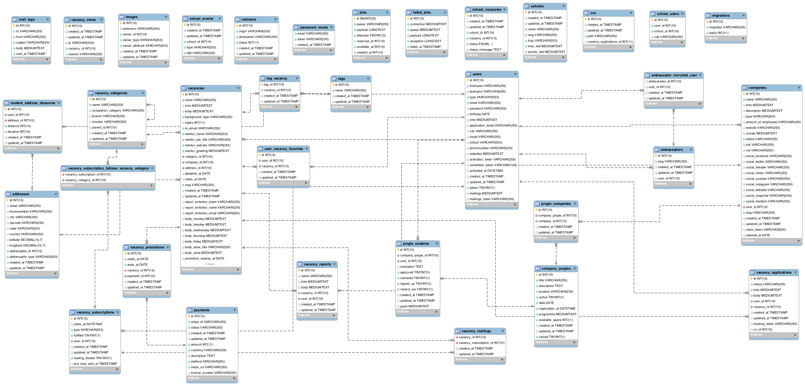](images/bijlae/huidig.png)

##Bijlage 2 - Nieuwe Datamodel
[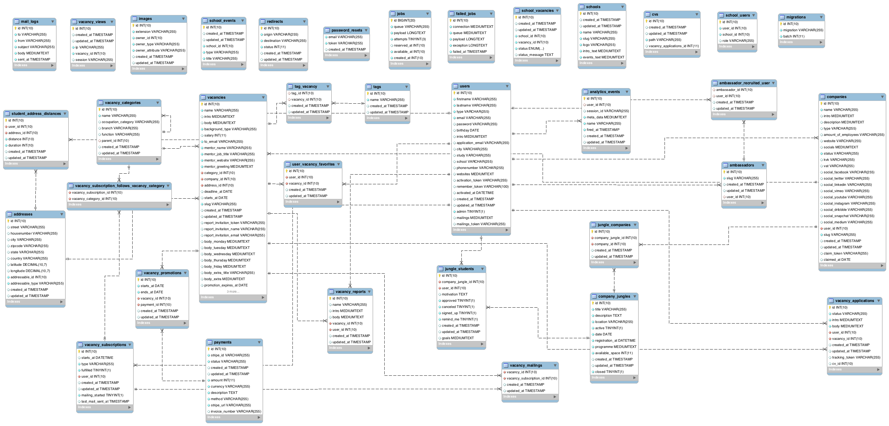](images/bijlae/nieuw.png)

#Bronnen
- Advanced Use Cases | Analytics Reporting API v4. (z.d.). Geraadpleegd 17 december 2017, van <https://developers.google.com/analytics/devguides/reporting/core/v4/advanced>
- Ajax. (z.d.). Geraadpleegd 17 december 2017, van <https://developer.mozilla.org/en-US/docs/Web/Guide/AJAX>
- Algemene voorwaarden. (z.d.). Geraadpleegd 17 december 2017, van <https://freshheroes.com/algemene-voorwaarden>
- Analytics. (z.d.). Geraadpleegd 17 december 2017, van <https://analytics.google.com/analytics/web/>
- <a name="anderson"></a>Anderson, S. P. (2011). Seductive Interaction Design: Creating Playful, Fun, and Effective User Experiences. Pearson Education.
- Baremetrics: Subscription Analytics & Insights for Stripe, Braintree, Recurly and more! (z.d.). Geraadpleegd 17 december 2017, van <https://baremetrics.com>
- Big data en profiling. (z.d.). Geraadpleegd 17 december 2017, van <https://autoriteitpersoonsgegevens.nl/nl/onderwerpen/internet-telefoon-tv-en-post/big-data-en-profiling>
- Black, A., Luna, P., Lund, O., & Walker, S. (2017). Information Design: Research and Practice. Taylor & Francis.
- Bostock, M. (2012, mei 2). Thinking with Joins. Geraadpleegd 17 december 2017, van <https://bost.ocks.org/mike/join/>
- Bostock, M., Carter, S., & Tse, A. (2014, mei 21). Is It Better to Rent or Buy? The New York Times. Geraadpleegd van <https://www.nytimes.com/interactive/2014/upshot/buy-rent-calculator.html>
- Brody, M. (2015, juli 15). How to drive UX with AJAX. Geraadpleegd 17 december 2017, van <https://www.webdesignerdepot.com/2015/07/how-to-drive-ux-with-ajax/>
- Chart dos and don’ts. (2016, maart 21). [Page]. Geraadpleegd 17 december 2017, van <https://www.eea.europa.eu/data-and-maps/daviz/learn-more/chart-dos-and-donts>
- Choudhury, S. (2013, juni 6). Choosing the right chart type: Bar charts vs Column charts - FusionBrew. Geraadpleegd 17 december 2017, van <https://www.fusioncharts.com/blog/bar-charts-or-column-charts/>
- Cookies. (z.d.). Geraadpleegd 17 december 2017, van <https://autoriteitpersoonsgegevens.nl/nl/onderwerpen/internet-telefoon-tv-en-post/cookies>
- Creating a Report | Analytics Reporting API v4. (z.d.). Geraadpleegd 17 december 2017, van <https://developers.google.com/analytics/devguides/reporting/core/v4/basics>
- De Sleepwet. (z.d.). Geraadpleegd 17 december 2017, van <https://sleepwet.nl>
- DSDM Atern Handbook (2008). (2015, november 10). Geraadpleegd 17 december 2017, van <https://www.agilebusiness.org/content/moscow-prioritisation-0>
- Eerste Kamer der Staten-Generaal - Wet op de inlichtingen- en veiligheidsdiensten 2017 (34.588). (z.d.). Geraadpleegd 17 december 2017, van <https://www.eerstekamer.nl/wetsvoorstel/34588_wet_op_de_inlichtingen_en>
- Engelfriet, A. (2015, januari 23). Mag mijn werkgever Google Analytics op het intranet zetten? Geraadpleegd 17 december 2017, van <https://blog.iusmentis.com/2015/01/23/mag-mijn-werkgever-google-analytics-op-het-intranet-zetten/>
- Engelfriet, A. (2016, december 16). Persoonsgegevens op Internet @ iusmentis.com door Arnoud Engelfriet. Geraadpleegd 17 december 2017, van <http://www.iusmentis.com/maatschappij/privacy/persoonsgegevens/>
- Events - Laravel - The PHP Framework For Web Artisans. (z.d.). Geraadpleegd 17 december 2017, van <https://laravel.com/docs/5.5/events>
- Fresh Heroes, stageplek voor creatieve vogels! (z.d.). Geraadpleegd 17 december 2017, van <https://freshheroes.com>
- Gallery · d3/d3 Wiki. (z.d.). Geraadpleegd 17 december 2017, van <https://github.com/d3/d3/wiki/Gallery#the-new-york-times-visualizations>
- Google Analytics Academy. (z.d.). Geraadpleegd 17 december 2017, van <https://analytics.google.com/analytics/academy/>
- Grimmett, C. (2016, augustus 14). D3 Intro and Joins Notes. Geraadpleegd 17 december 2017, van <http://www.cagrimmett.com/til/2016/08/14/d3-introduction-notes.html>
- Handy, T. (2017, maart 31). The Startup Founder’s Guide to Analytics. Geraadpleegd 17 december 2017, van <https://thinkgrowth.org/the-startup-founders-guide-to-analytics-1d2176f20ac1>
- Hickey, W. (2013, juni 17). The Worst Chart In The World. Geraadpleegd 17 december 2017, van <http://www.businessinsider.com/pie-charts-are-the-worst-2013-6>
- Hopkins, N. (2017, september 25). Deloitte hit by cyber-attack revealing clients’ secret emails. The Guardian. Geraadpleegd van <http://www.theguardian.com/business/2017/sep/25/deloitte-hit-by-cyber-attack-revealing-clients-secret-emails>
- Introduction to events. (z.d.). Geraadpleegd 17 december 2017, van <https://developer.mozilla.org/en-US/docs/Learn/JavaScript/Building_blocks/Events>
- Kirk, A., Timms, S., Rininsland, Ǯdrew, & Teller, S. (2016). Data Visualization: Representing Information on Modern Web. Packt Publishing Ltd.
- Kissmetrics | Behavioral analytics and engagement platform. (z.d.). Geraadpleegd 17 december 2017, van <https://www.kissmetrics.com/>
- Kulche, P. (z.d.). Privacy op internet | Consumentenbond. Geraadpleegd 17 december 2017, van <https://www.consumentenbond.nl/internet-privacy>
- Laravel - The PHP Framework For Web Artisans. (z.d.). Geraadpleegd 17 december 2017, van <https://laravel.com/>
- laravel-analytics: A Laravel package to retrieve pageviews and other data from Google Analytics. (2017). PHP, Spatie. Geraadpleegd van <https://github.com/spatie/laravel-analytics> (Original work published 2015)
- Laubheimer, P. (2017, juni 18). Dashboards: Making Charts and Graphs Easier to Understand. Geraadpleegd 17 december 2017, van <https://www.nngroup.com/articles/dashboards-preattentive/>
- Ltd, H. (z.d.). Hotjar - Heatmaps, Visitor Recordings, Conversion Funnels, Form Analytics, Feedback Polls and Surveys in One Platform. Geraadpleegd 17 december 2017, van <https://www.hotjar.com>
- Mester, T. (2017, januari 23). Google Analytics vs. SQL - When and why to build your own data tools? Geraadpleegd 17 december 2017, van <https://data36.com/build-data-tools-google-analytics-vs-sql/>
- Mixpanel | Product Analytics for Mobile, Web, and Beyond. (z.d.). Geraadpleegd 17 december 2017, van <https://mixpanel.com/>
- Murray, S. (2017). Interactive Data Visualization for the Web: An Introduction to Designing with. O’Reilly Media, Inc.
- Murray, S. (z.d.). Interactive Data Visualization for the Web. Geraadpleegd 17 december 2017, van <http://chimera.labs.oreilly.com/books/1230000000345/index.html>
-  <a name="anderson"></a>Ng, A. (2017, september 8). Equifax data leak may affect up to nearly half the US population. Geraadpleegd 17 december 2017, van <https://www.cnet.com/news/equifax-data-leak-hits-nearly-half-of-the-us-population/>
- Nielsen, J. (2006, april 12). Progressive Disclosure. Geraadpleegd 17 december 2017, van <https://www.nngroup.com/articles/progressive-disclosure/>
- O’Sullivan, D. (2016, januari 11). 6 steps to designing better dashboards. Geraadpleegd 17 december 2017, van <https://www.invisionapp.com/blog/designing-better-dashboards/>
- Overview | Analytics Reporting API v4. (z.d.). Geraadpleegd 17 december 2017, van <https://developers.google.com/analytics/devguides/reporting/core/v4/>
- Perna, M. A. (2016, maart 23). Canvas vs. SVG: Choosing the Right Tool for the Job. Geraadpleegd 17 december 2017, van <https://www.sitepoint.com/canvas-vs-svg-choosing-the-right-tool-for-the-job/>
- Pricing - Mixpanel | Product Analytics. (z.d.). Geraadpleegd 17 december 2017, van <https://mixpanel.com/pricing/>
- Privacybeleid. (z.d.). Geraadpleegd 17 december 2017, van <https://freshheroes.com/privacy-policy>
- rapportprivacyjijvandaagnationaleprivacytest.pdf. (z.d.). Geraadpleegd van <https://eenvandaag.avrotros.nl/fileadmin/editorial/docs/rapportprivacyjijvandaagnationaleprivacytest.pdf>
- Ribecca, S. (z.d.). The Data Visualisation Catalogue. Geraadpleegd 17 december 2017, van <https://datavizcatalogue.com/index.html>
- rj45. (2008, april 8). Simple Example of MVC (Model View Controller) Design Pattern for Abstraction - CodeProject. Geraadpleegd 17 december 2017, van <https://www.codeproject.com/Articles/25057/Simple-Example-of-MVC-Model-View-Controller-Design>
- Rost, L. C. (2017, maart 10). Why Do We Visualise Data? · Lisa Charlotte Rost. Geraadpleegd 17 december 2017, van <https://lisacharlotterost.github.io/2017/03/10/why-do-we-visualize-data/>
- rs_20071211_persoonsgegevens_op_internet_definitief.pdf. (z.d.). Geraadpleegd van <https://autoriteitpersoonsgegevens.nl/sites/default/files/downloads/rs/rs_20071211_persoonsgegevens_op_internet_definitief.pdf>
- Soegaard, M. (z.d.). Gestalt principles of form perception. Geraadpleegd 17 december 2017, van <https://www.interaction-design.org/literature/book/the-glossary-of-human-computer-interaction/gestalt-principles-of-form-perception>
- Subotin, S. (z.d.). Dashboard Design - Considerations and Best Practices. Geraadpleegd 17 december 2017, van <https://www.toptal.com/designers/data-visualization/dashboard-design-best-practices>
- SVG vs canvas: how to choose (Windows). (z.d.). Geraadpleegd 17 december 2017, van <https://msdn.microsoft.com/en-us/library/gg193983%28v=vs.85%29.aspx>
- The Gestalt Principles. (z.d.). Geraadpleegd 17 december 2017, van <http://graphicdesign.spokanefalls.edu/tutorials/process/gestaltprinciples/gestaltprinc.htm>
- Tufte, E. R. (1992). Envisioning Information. Graphics Press.
- Ware, C. (2004). Information Visualization: Perception for Design. Elsevier.
- Wootric | In-App Web & Mobile, Email, SMS Net Promoter Score, CSAT, CES Survey Software, Text & Sentiment Analytics. (z.d.). Geraadpleegd 17 december 2017, van <https://www.wootric.com/>
- XenitXTD. (2014, oktober 15). New to Laravel,MVC and need a little clarity on MVC | Laravel.io. Geraadpleegd 17 december 2017, van <https://laravel.io/forum/10-15-2014-new-to-laravelmvc-and-need-a-little-clarity-on-mvc>


#Termen
- TBA (To be added)